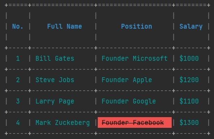
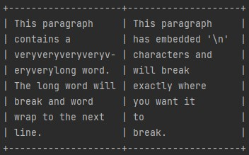

<p align="center">
    
</p>

<div align="center">
  <strong>Fun table maker for Dart language</strong>
</div>
<div align="center">
  Tabulate is a Dart library for making beautiful nested tables in the terminal.
</div>

<br />

<p align="center">
  <a href="https://github.com/p-ranav/tabulate/blob/master/LICENSE">
    
  </a>
  
</p>

## Table of Contents

*   [Description](#description)
*   [Styling Options](#styling-options)
    *   [Style Inheritance Model](#style-inheritance-model)
    *   [Word Wrapping](#word-wrapping)
    *   [Font Alignment](#font-alignment)
    *   [Font Styles](#font-styles)
    *   [Cell Colors](#cell-colors)
    *   [Borders and Corners](#borders-and-corners)
    *   [Range-based Iteration](#range-based-iteration)
    *   [Nested Tables](#nested-tables)
    *   [UTF-8 Support](#utf-8-support)

## Description

`tabulate` help those who want to create beautiful and high customizable tables in the terminal easily.

**NOTE** Tabulate supports Dart `>=2.17.5`.

For quick start just create a `Table` object and call `Table.addRows` to add rows to your table and enjoy it.
```dart
import 'package:tabulate/tabulate.dart';

void main() {
  Table table = Table();
  table.addRow(["No.", "Full Name", "Position", "Salary"]);
  table.addRow(["1", "Bill Gates", "Founder Microsoft", "\$1000"]);
  table.addRow(["2", "Steve Jobs", "Founder Apple", "\$1200"]);
  table.addRow(["3", "Larry Page", "Founder Google", "\$1100"]);
  table.addRow(["4", "Mark Zuckerberg", "Founder Facebook", "\$1300"]);
}
```

You can style a table by using the `Table.theme` getter which returns a `TableTheme` object then you are able to change properties of the table, e.g., borders, text styles, colors etc.

```dart
  table.theme
    .setBorderColor(Color.red)
    .setFontColor(Color.cyan);
```

You can access rows in the table using `Table[rowIndex]` or `Table.rowAt(rowIndex)`. This will return a `Row` object on which you can similarly use getter `Row.theme` to stylize properties of all the cells in that row.

Now, let's stylize the header of the table. The code below will change font color of the cells to `blue`, aligns row content to `center`, applies font style to `bold`, changes border top character to `=` and add padding to the bottom and top of the row content.

```dart
   table[0].theme
    .setFontColor(Color.blue)
    .setTextAlign(TextAlign.center)
    .setFontStyle({FontStyle.bold})
    .setBorderTop("=")
    .setPaddingTop(1)
    .setPaddingBottom(1);
```

Also you can access columns in the table by using `Table.columnAt(columnIndex)`. This will return a `Column` object which you can use the getter `Column.theme` to stylize properties all of the cells of the column.

```dart
   table.columnAt(0).theme
    .setTextAlign(TextAlign.center);
```

By the above code you can see that all of the cells in first column is aligned to `center`.

Now what about to change properties of specific cell in specific row or column?

You can easily stylizing use Dart index operators to access specific cell from a row by using `Table[rowIndex][colIndex]` or from a column by using `Table.columnAt(colIndex)[cellIndex]`.

We want to change properties of cell `Founder FaceBook` in index row `4` and column `2`. So just use `table[4][2]` to change font color to `grey` with font background `red` and font style `crossed`.

**NOTE** To access this cell by column we use `table.columnAt(2)[4]`.

```dart
   table[4][2].theme
    .setFontColor(Color.grey)
    .setFontBackground(Color.red)
    .setFontStyle({FontStyle.crossed});
```
`tabulate` is using Dart `StringBuffer` class for render tables. There is two ways of render tables one way is `StringBuffer` another way is just using Dart built-in `print` function to print the `Table` object.

print using `StringBuffer`:
```dart
   StringBuffer stringBuffer = StringBuffer();
   table.render(stringBuffer);
   print(stringBuffer);
```

**NOTE 1** `tabulate` use `TermColor` class for stylizing and colorizing fonts. In this class there is an property called `isAnsiColorDisabled` this property will globally `disables` or `enables` **ANSI escapes**. When environment doesn't support ANSI escapes `default` is set to `true` and ANSI escapes will not added into the table!. But can be overridden to force ANSI escapes adds to the table.

**NOTE 2** some IDEs default is set to `true` but they support ANSI escapes so you have to manually set the `TermColor.isAnsiColorDisabled` to `false`.

Final result will be:
<p align="center">
    
</p>

## Styling Options

### Style Inheritance Model

Styling in `tabulate` follows a simple style-inheritance model. When rendering each cell:
1.    Apply cell styling if specified
2.    If no cell styling is specified, apply its parent row styling
3.    If no row styling is specified, apply its parent table styling
4.    If no table styling is specified, apply the default table styling

This enables overriding the styling for a particular cell even though row or table styling is specified, e.g., when an entire row is colored `yellow` but you want a specific cell to be colored `red`.

**NOTE** Currently we don't support style-inheritance for nested tables. e.g, when we add `Table` object to another `Table` by using `Table.addRow` method, target table won't apply it's parent table style.

### Word Wrapping

`tabulate` supports automatic word-wrapping when printing cells.

Although word-wrapping is automatic, there is a simple override. Automatic word-wrapping is used only if the cell contents do not have any embedded newline `\n` characters. So, you can embed newline characters in the cell contents and enforce the word-wrapping manually.


```dart
import 'package:tabulate/tabulate.dart';

void main() {
  Table table = Table();

  table.addRow([
    "This paragraph contains a veryveryveryveryveryverylong word. The long word will "
        "break and word wrap to the next line.",
    "This paragraph \nhas embedded '\\n' \ncharacters and\n will break\n exactly "
        "where\n you want it\n to\n break."
  ]);

  table[0][0].theme.setWidth(20);
  table[0][1].theme.setWidth(20);

  print(table);
}
```
*  The above table has 1 row and 2 columns.
*  The first cell has automatic word-wrapping.
*  The second cell uses the embedded newline characters in the cell contents - even though the second column has plenty of space (50 characters width), it uses user-provided newline characters to break into new lines and enforce the cell style.
*  **NOTE**: Whether word-wrapping is automatic or not, `tabulate` performs a trim operation on each line of each cell to remove whitespace characters from either side of line.

**NOTE** Currently word-wrapping have some problems with font styles and colors because wrapping ANSI doesn't implemented on wrapping algorithm.

<p align="center">
    
</p>
